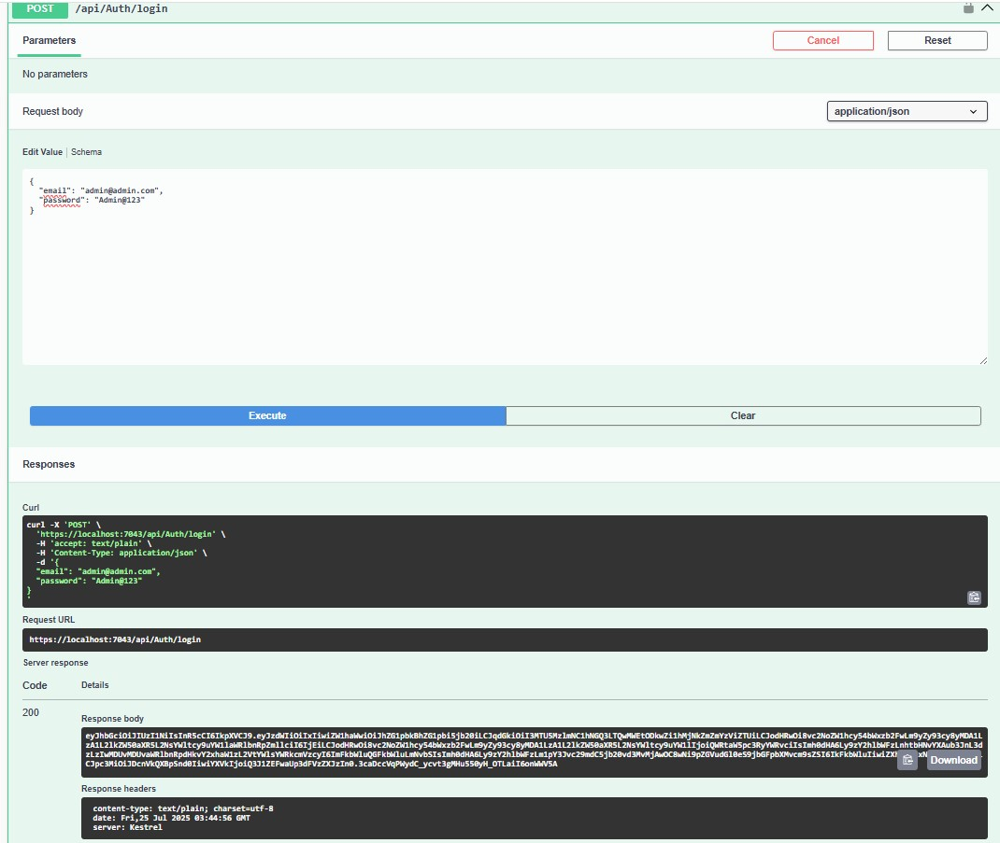
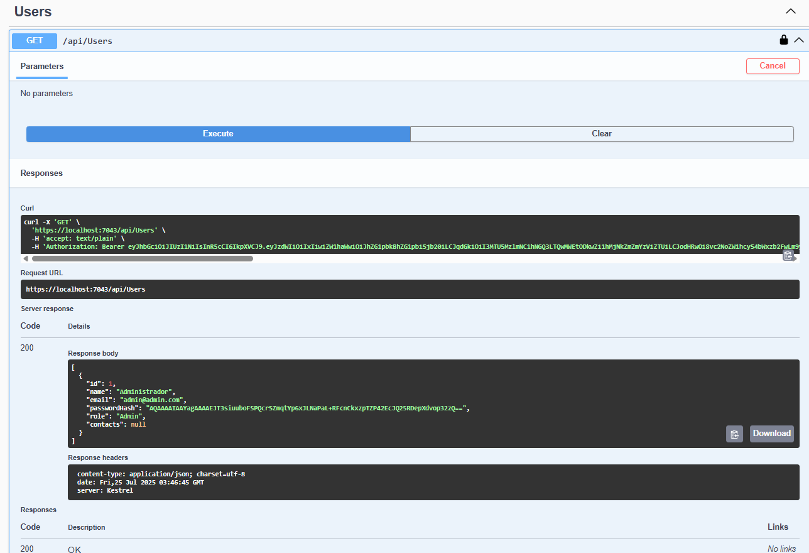
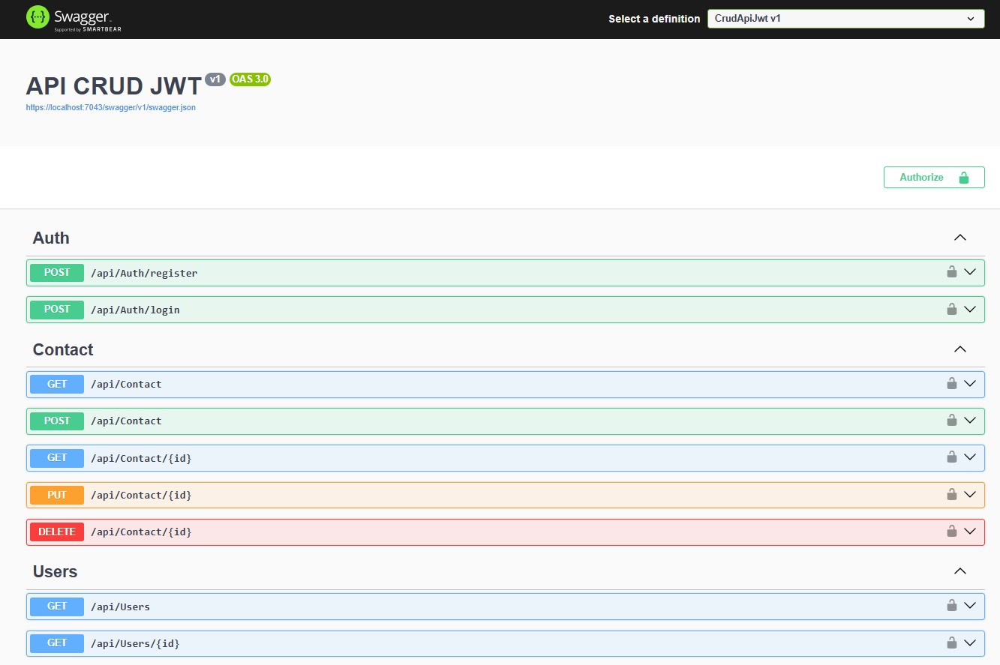

# 📦 CrudApiJwt

API RESTful desenvolvida com ASP.NET Core 8, Entity Framework Core e autenticação via JWT. Permite gerenciamento de usuários e seus contatos pessoais, com proteção de rotas e autenticação baseada em tokens.

---

## 🚀 Funcionalidades

- 🔐 Cadastro e login com autenticação JWT
- 👤 CRUD completo de usuários
- 📇 CRUD completo de contatos (relação 1:N)
- 🛡️ Proteção de rotas com autorização baseada em JWT e Claims
- 👮 Autorização baseada em roles (ex: somente Admin pode acessar /api/users)
- ✅ Validações com FluentValidation
- 📄 Documentação interativa com Swagger
- 🧪 Testes unitários para Services, Validators, Controllers e Middleware
- 🗃️ Banco de dados com EF Core e Migrations

---

## 🧱 Stack Tecnológico

- ✅ ASP.NET Core 8
- ✅ Entity Framework Core 8
- ✅ SQL Server (ou SQLite)
- ✅ JWT (JSON Web Token)
- ✅ FluentValidation
- ✅ Swagger (Swashbuckle)
- ✅ xUnit + Moq (para testes)

---

## 🛠️ Como executar localmente

1. Clone o repositório:

```bash
git clone https://github.com/seu-usuario/CrudApiJwt.git
```

2. Acesse o diretório:

```bash
cd CrudApiJwt
```

3. Configure a string de conexão no arquivo appsettings.json:

```bash
json
"ConnectionStrings": {
  "DefaultConnection": "Server=(localdb)\\mssqllocaldb;Database=Db;Trusted_Connection=True;"
}
```

4. Configure a chave JWT no appsettings.json:
```bash
json
"JwtSettings": {
  "SecretKey": "sua-chave-super-secreta-256bits-exemplo",
  "Issuer": "CrudApiJwt",
  "Audience": "CrudApiJwtUsers",
  "ExpirationInMinutes": 60
}
```

🛑 Importante: o SecretKey deve ter pelo menos 256 bits (32 caracteres em UTF-8) para o algoritmo HS256 funcionar corretamente.

5. Execute as migrações:

```bash
dotnet ef database update
```

6. Execute a aplicação:

```bash
dotnet run
```

7. Acesse o Swagger UI:

```bash
https://localhost:7035/swagger
```

---

## 🔐 Como testar a autenticação JWT (via Swagger)

1. Faça um POST em /api/auth/register com email e senha válidos

2. Em seguida, faça login com POST em /api/auth/login

3. Copie o token JWT gerado

4. Clique em “Authorize” no Swagger UI e insira:

```bash
Bearer SEU_TOKEN_AQUI
```

5. Agora você poderá acessar rotas protegidas como /api/users ou /api/contacts

---

## 🔐 Estrutura do Token JWT

O token gerado inclui Claims (informações embutidas no token) como:

- sub: ID do usuário
- email: Email do usuário
- jti: Identificador único do token
- nameidentifier: ID do usuário
- name: Nome do usuário
- email: Email do usuário (repetido como claim padrão)
- role: Papel do usuário (ex: "User", "Admin")

Essas claims são usadas para validar o contexto da requisição nas rotas protegidas, habilitando cenários de autorização baseados em roles e identidade.

Exemplo de payload decodificado:
```bash
json
{
  "sub": "1",
  "email": "admin@admin.com",
  "jti": "some-guid",
  "nameidentifier": "1",
  "name": "Admin",
  "role": "User"
}
```

---

## 🧪 Testes Automatizados

✅ Serviços: AuthService, UserService, ContactService  
✅ Validadores: FluentValidation com cobertura completa  
✅ Middleware: ExceptionHandlingMiddleware  
✅ Controllers: AuthController, UsersController, ContactController  

📦 Execute os testes com:

```bash
dotnet test
```

---

## 🗂️ Estrutura do Projeto

```bash
├── Controllers
│   └── AuthController.cs
│   └── UsersController.cs
│   └── ContactsController.cs
│
├── Data
│   └── AppDbContext.cs
│
├── DTOs
│   └── UserDTO.cs
│   └── ContactDTO.cs
│   └── LoginDTO.cs
│
├── Middlewares
│   └── ExceptionHandlingMiddleware.cs
│
├── Migrations
│
├── Models
│   └── User.cs
│   └── Contact.cs
│
├── Services
│   └── ApplicationDbContext.cs
│   └── AuthService.cs
│   └── ContactService.cs
│   └── TokenService.cs
│   └── UserService.cs
│
├── Settings
│   └── JwtSettings.cs
│
├── Validators
│   └── UserDTOValidator.cs
│   └── ContactDTOValidator.cs
│   └── LoginDTOValidator.cs
│
├── Program.cs
├── appsettings.json
└── README.md
```

---

📸 Exemplos no Swagger UI
Imagens reais capturadas diretamente da interface Swagger da aplicação.

🔐 Login com JWT


📁 Rotas protegidas autenticadas


📚 Visão geral do Swagger


---

## 👨‍💻 Autor

Desenvolvido por Gilberto Andreatta Maia  
https://www.linkedin.com/in/gilbertoandreatta/

---

## 📝 Licença

Este projeto está sob a licença MIT. Sinta-se livre para utilizar, modificar e distribuir.

---
